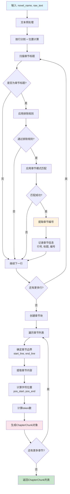
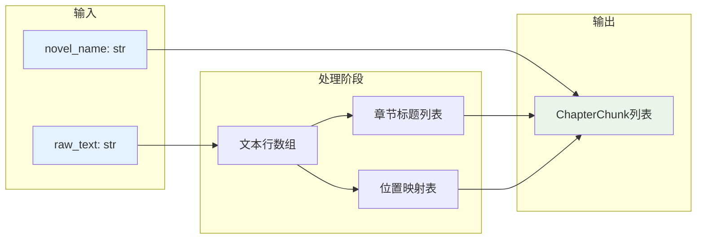

# 章节分块提取器设计文档

## 概述

`chapter_chunk_extractor_fanren_impl.py` 是一个专门用于《凡人修仙传》小说章节分块提取的工具。该工具专注于将原始文本分割成结构化的章节块，便于后续的数据挖掘和分析。

## 设计目标

- **职责单一**: 专注于文本分块处理，不关心数据来源
- **接口简洁**: 提供简单易用的静态方法接口
- **结构化输出**: 输出标准化的章节块数据结构
- **无过度设计**: 避免复杂的统计和验证功能

## 核心数据结构

### ChapterChunk

章节块的数据结构定义：

```python
from pydantic import BaseModel, Field
import uuid

class ChapterChunk(BaseModel):
    """章节块数据结构"""
    novel_name: str = Field(description="小说名称")
    chunk_id: str = Field(description="章节块唯一标识符(UUID)")
    chapter_id: int = Field(description="章节编号")
    chapter_title: str = Field(description="章节标题")

    # 位置信息
    line_start: int = Field(description="开始行号")
    line_end: int = Field(description="结束行号")
    pos_start: int = Field(description="在原文中的字符开始位置")
    pos_end: int = Field(description="在原文中的字符结束位置")

    # 统计信息
    char_count: int = Field(description="字符数")
    token_count: int = Field(description="词元数")

    # 内容
    content: str = Field(description="章节内容")
```

**字段说明**:
- `novel_name`: 小说名称
- `chunk_id`: 使用UUID（不带横线）保证每个章节块的唯一性
- `chapter_id`: 章节编号（阿拉伯数字），从章节标题中提取
- `chapter_title`: 完整的章节标题文本（从title改为chapter_title）
- `line_start/line_end`: 章节在原文中的行号范围
- `pos_start/pos_end`: 章节在原文中的字符位置范围
- `char_count`: 章节内容的字符数量
- `token_count`: 章节内容的词元数量（可用于后续分析）
- `content`: 章节的完整文本内容

## 核心接口

### ChapterChunkExtractor 类

```python
class ChapterChunkExtractor:
    """章节块提取器"""

    @staticmethod
    def extract_chapter_chunks(novel_name: str, raw_text: str) -> List[ChapterChunk]:
        """
        从原始文本提取章节块

        Args:
            novel_name: 小说名称
            raw_text: 原始文本内容

        Returns:
            List[ChapterChunk]: 章节块列表
        """
```

**接口特点**:
- 静态方法，无需实例化
- 输入为小说名称和原始文本字符串
- 输出为结构化的章节块列表
- 每个章节块的 `novel_name` 字段设置为输入的小说名称

## 核心算法

1. **按行分割文本**，保留行号信息

2. **识别章节标题**：
   - 正则匹配：`第X章`、`第X卷...第Y章`
   - 数字格式：支持中文数字和阿拉伯数字
   - 实际示例：`第1713章得丹`、`第一千七百一十四章甲士`、`第七卷纵横人界第一千一百三十章拦截`
   - 排除规则：过滤对话、正文等误识别

3. **提取章节编号**：
   - 中文数字转阿拉伯数字：`第一千一百八十一章` → `1181`
   - 支持基础数字和复合数字

4. **创建章节块**：
   - 计算章节内容的行号和字符位置范围
   - 提取章节内容文本
   - 统计字符数和词元数
   - 生成UUID（不带横线）作为唯一标识

5. **确定内容边界**：
   - 开始：章节标题下一行
   - 结束：下个章节标题前一行（最后一章到文本末尾）

## 使用示例

```python
# 基本使用
with open("resources/ignored/1.txt", 'r', encoding='gb2312') as f:
    raw_text = f.read()

chunks = ChapterChunkExtractor.extract_chapter_chunks("fanren", raw_text)

# 使用结果
for chunk in chunks:
    print(f"小说: {chunk.novel_name}")
    print(f"章节 {chunk.chapter_id}: {chunk.chapter_title}")
    print(f"唯一ID: {chunk.chunk_id}")
    print(f"位置: 第{chunk.line_start}-{chunk.line_end}行")
    print(f"字符数: {chunk.char_count}")
```

## 设计原则

### 1. 单一职责原则
- 只负责章节分块提取
- 不处理文件读写
- 不进行复杂的数据分析

### 2. 最小化接口
- 只提供一个核心方法 `extract_chapter_chunks`
- 避免过度抽象和复杂的配置

### 3. 数据驱动
- 输入输出结构清晰
- 便于后续处理和分析

### 4. 无状态设计
- 纯函数式设计
- 可预测的输入输出

## 技术实现要点

### 1. 正则表达式模式
```python
CHAPTER_PATTERNS = [
    # 卷+章节模式：如 "第七卷纵横人界第一千一百三十章拦截"
    (r'^第([零一二三四五六七八九十百千万两\d]+)卷.*第([零一二三四五六七八九十百千万两\d]+)章', 'volume_chapter'),
    # 纯章节模式：如 "第1713章得丹"、"第一千七百一十四章甲士"
    (r'^第([零一二三四五六七八九十百千万两\d]+)章', 'chapter')
]
```

### 2. 排除规则
```python
EXCLUDE_PATTERNS = [
    # 暂时置空，用于测试基本章节识别效果
    # r'.*["\"「『].*["\"」』].*',  # 包含对话引号
    # r'.*(说道|回答道|喊道|想到).{5,}.*',  # 包含对话词汇
    # r'.{50,}',  # 过长的行
]
```

### 3. 位置计算
- `pos_start`: 标题行在原文中的累计字符位置
- `pos_end`: 章节结束行在原文中的累计字符位置
- `line_start/line_end`: 基于0的行号索引

## 具体实现方案

### 实现流程图



### 核心数据流



### 1. 核心算法移植

**中文数字转换算法**：
```python
def _enhanced_chinese_to_number(chinese_str: str) -> int:
    """基于已验证算法的中文数字转换"""
    digits = {'零': 0, '一': 1, '二': 2, '三': 3, '四': 4, '五': 5, '六': 6, '七': 7, '八': 8, '九': 9, '两': 2}
    units = {'十': 10, '百': 100, '千': 1000, '万': 10000, '亿': 100000000}

    # 移除占位符零，处理万、亿级单位，计算小单位
    # 完整实现包含所有边界情况处理
```

**章节标题识别**：
```python
def _is_valid_chapter_title(self, line: str) -> Tuple[bool, str, int, str]:
    """识别章节标题，返回 (是否有效, 章节类型, 章节编号, 完整标题)"""
    # 1. 应用排除规则过滤误识别
    # 2. 应用章节模式匹配
    # 3. 提取章节编号并转换
    # 4. 返回识别结果
```

### 2. 位置追踪机制

**字符位置计算**：
```python
def _calculate_text_positions(self, text: str) -> Dict[int, int]:
    """计算每行在原文中的起始字符位置"""
    lines = text.split('\n')
    positions = {}
    current_pos = 0

    for i, line in enumerate(lines):
        positions[i] = current_pos
        current_pos += len(line) + 1  # +1 for newline

    return positions
```

**章节边界确定**：
- 章节内容开始：章节标题行号 + 1
- 章节内容结束：下一章节标题行号 - 1
- 最后一章：到文本末尾

### 3. ChapterChunk构建流程

```python
def _create_chapter_chunk(
    self,
    novel_name: str,
    title: str,
    chapter_id: int,
    content: str,
    line_start: int,
    line_end: int,
    positions: Dict[int, int]
) -> ChapterChunk:
    """创建ChapterChunk对象"""

    # 计算字符位置
    pos_start = positions.get(line_start, 0)
    pos_end = positions.get(line_end, pos_start) + len(content.split('\n')[-1])

    # 使用utils.count_tokens计算token数
    token_count = count_tokens(content)

    # 调用ChapterChunk.create_chunk创建对象
    return ChapterChunk.create_chunk(
        novel_name=novel_name,
        chapter_id=chapter_id,
        chapter_title=title,
        content=content,
        line_start=line_start,
        line_end=line_end,
        pos_start=pos_start,
        pos_end=pos_end,
        token_count=token_count
    )
```

### 4. 主流程实现

```python
@staticmethod
def extract_chapter_chunks(novel_name: str, raw_text: str) -> List[ChapterChunk]:
    """主入口函数"""

    # 1. 预处理
    lines = raw_text.split('\n')
    positions = _calculate_text_positions(raw_text)

    # 2. 扫描章节标题
    chapter_lines = []
    for i, line in enumerate(lines):
        is_valid, chapter_type, chapter_id, full_title = _is_valid_chapter_title(line.strip())
        if is_valid:
            chapter_lines.append((i, chapter_id, full_title))

    # 3. 创建章节块
    chunks = []
    for i, (line_num, chapter_id, title) in enumerate(chapter_lines):
        # 确定内容边界
        content_start = line_num + 1
        content_end = chapter_lines[i+1][0] if i+1 < len(chapter_lines) else len(lines)

        # 提取内容
        content = '\n'.join(lines[content_start:content_end])

        # 创建ChapterChunk
        chunk = _create_chapter_chunk(
            novel_name, title, chapter_id, content,
            content_start, content_end - 1, positions
        )
        chunks.append(chunk)

    return chunks
```

### 5. 错误处理策略

- **空文本处理**：返回空列表
- **章节识别失败**：跳过无效行，继续处理
- **位置计算错误**：使用默认值（0）
- **编码错误**：已在utils.py中处理
- **大文件处理**：使用逐行处理，避免内存溢出

### 6. 性能优化

- **单次扫描**：章节识别和位置计算在一次遍历中完成
- **延迟计算**：token计算只在需要时进行
- **内存管理**：使用生成器处理大文件
- **缓存机制**：中文数字转换结果缓存（可选）

## 输出格式示例

```python
[
    ChapterChunk(
        novel_name="fanren",
        chunk_id="550e8400e29b41d4a716446655440000",
        chapter_id=1,
        chapter_title="第一章山边小村",
        line_start=0,
        line_end=45,
        pos_start=0,
        pos_end=2156,
        char_count=2156,
        token_count=1203,
        content="..."
    ),
    # ... 更多章节块
]
```

## 后续扩展可能

虽然当前设计保持简洁，但为后续扩展预留了空间：

1. **多种分块策略**: 可按卷分块
2. **内容过滤**: 可过滤掉特定类型的内容
3. **元数据扩展**: 可添加更多章节元信息
4. **性能优化**: 对大文件的流式处理

---

*设计文档版本: 1.0*
*最后更新: 2025-11-07*